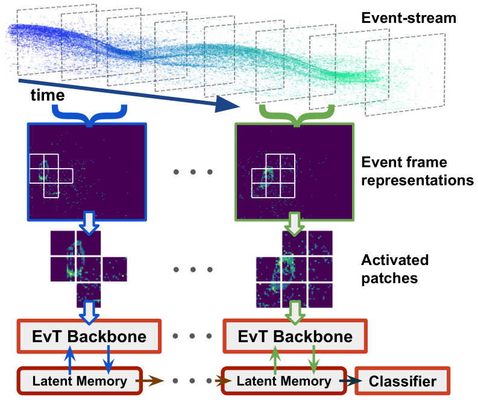

[[Paper](https://arxiv.org/abs/2204.03355)] [[Supplementary video](https://drive.google.com/file/d/1X4OviJTxTUbi2W0zQYKG3qqtEUf98a0p/view?usp=sharing)]

This repository contains the official code from __Event Transformer. A sparse-aware solution for efficient event data processing__. 

Event Transformer (EvT) takes advantage of the event-data sparsity to increase its efficiency. EvT usses a new sparse patch-based event-data representation and a compact transformer architecture that naturally processes it. EvT shows high classification accuracy while requiring minimal computation resources, being able to work with minimal latency both in GPU and CPU. 

<p align="center">
  
</p>

#### Citation:
```
@InProceedings{Sabater_2022_CVPR,
    author    = {Sabater, Alberto and Montesano, Luis and Murillo, Ana C.},
    title     = {Event Transformer. A sparse-aware solution for efficient event data processing},
    booktitle = {Proceedings of the IEEE/CVF Conference on Computer Vision and Pattern Recognition (CVPR) Workshops},
    month     = {June},
    year      = {2022},
}
```


### REPOSITORY REQUIREMENTS

The present work has been developed and tested with Python 3.7.10, pytorch 1.9.0 and Ubuntu 18.04
To reproduce our results we suggest to create a Python environment as follows.

```
conda create --name evt python=3.7.10
conda activate evt
pip install -r requirements.txt
```


### PRETRAINED MODELS

The pretrained models must be located under a `./pretrained_models` directory and can be downloaded from Drive (
[DVS128 10 classes](https://drive.google.com/file/d/184I-hOOyGwzsT9uPBUXrbhR2Trou0JJh/view?usp=sharing), 
[DVS128 11 classes](https://drive.google.com/file/d/1pzvVgIC9aSpCjvl3IUQj_NT6JK-fJVHJ/view?usp=sharing), 
[Sl-Animals 3-Sets](https://drive.google.com/file/d/1nDwVZQ5ivnyBSW1U3hH51ebv3nudDUQN/view?usp=sharing), 
[Sl-Animals 4-Sets](https://drive.google.com/file/d/1BAM2DTbyqN_AUR0aIlHuJUuRl65xQKL6/view?usp=sharing), 
[ASL-DVS](https://drive.google.com/file/d/1WqCcuLILKO1ACeGV4tj1KgP5Bdut8Pqe/view?usp=sharing)).


### DATA DOWNLOAD AND PRE-PROCESSING

The datasets involved in the present work must be downloaded from their source and stored under a `./datasets` path:
 - DVS128: https://research.ibm.com/interactive/dvsgesture/
 - SL-Animals-DVS: http://www2.imse-cnm.csic.es/neuromorphs/index.php/SL-ANIMALS-DVS-Database
 - ASL: https://github.com/PIX2NVS/NVS2Graph
 - N-Caltech-101: https://www.garrickorchard.com/datasets/n-caltech101

In order to have a faster training process we pre-process the source data by building intermediate sparse frame representations, that will be later loaded by our data generator.
This transformation can be perfomed with the files located under `./dataset_scripts`.
In the case of DVS128, it is mandatory to execute first `dvs128_split_dataset.py` and later `dvs128.py`.


### EvT EVALUATION

The evaluation of our pretrained models can be performed by executing: `python evaluation_stats.py`
At the beginning of the file you can select the pretrained model to evaluate and the device where to evaluate it (CPU or GPU). Evaluation results include FLOPs, parameters, average activated patches, average processing time, and validation accuracy.


### EvT TRAINING

The training of a new model can be performed by executing: `python train.py`
At the beginning of the file you can select the pretraining model from where to copy its training hyper-parameters.
Note that, since the involved datasets do not contain many training samples and there is data augmentation involed in the training, final results might not be exactly equal than the ones reported in the article. If so, please perform several training executions.
